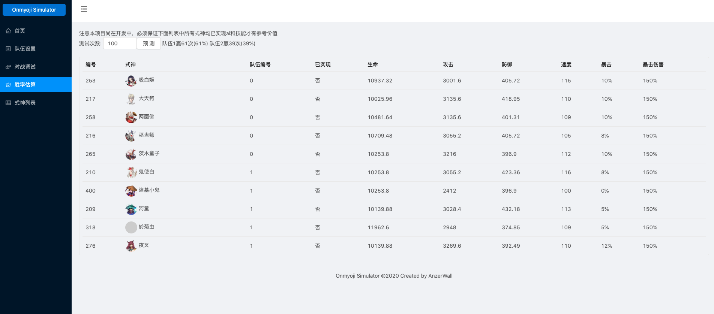
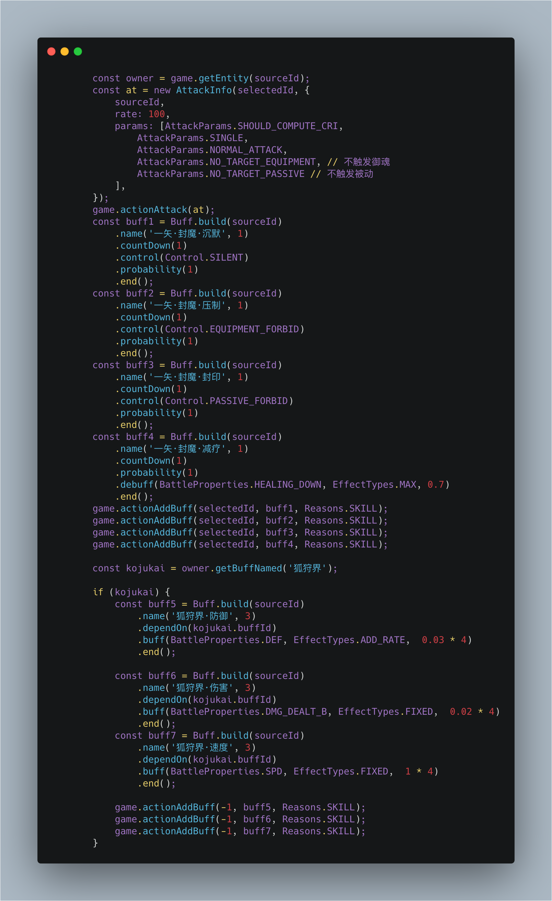

# 概述

本项目旨在通过实现阴阳师整体机制，以及式神逻辑以及AI，可以实现对局模拟，机制测试，对弈竞猜胜率预测的功能

# Github Page

[预览](https://anzerwall.github.io/)

# 运行环境

[node.js](https://nodejs.org)  
[vue.js](https://vuejs.org)  
[pixi.js](https://www.pixijs.com/)  

# 运行方式

## 安装node

从[官网](https://nodejs.org)根据平台下载安装包
## 安装依赖
在项目跟目录下执行：
```shell
npm i
```
## 运行
在项目跟目录下执行：
```shell
npm run serve
```
## 预览



## 技能编写示例


# Roadmap

## 当前备忘

- [ ] buff冲突覆盖机制
- [x] 整理输出和代码
- [ ] 全局增加Player用于存储全局buff 结界等

## 核心组件
- [x] UI-式神数据页
- [x] UI-队伍录入页
- [x] UI-对战调试页(基础)
- [ ] UI-对战调试页(pixi)
- [x] UI-对弈竞猜预测页(对战模拟法)
- [ ] UI-对弈竞猜预测页(机器学习法)
- [x] Mana(鬼火机制) 
- [x] Runway(行动条)  
- [x] Team(队伍) 
- [ ] Equipment(基础御魂) 
- [x] Buff(buff机制) 
- [x] Skill(技能机智) 
- [x] Entity(实体) 
- [x] Hero(式神) 
- [x] Event(事件机制) 

## 式神进度

目前可以做到：
如果全式神40级不带御魂分列两队的胜率预测
其中已完成逻辑的式神有

### 呱
呱(0 / 14)

### N
N (11 / 12)
- [x] 赤舌
- [x] 天邪鬼红
- [x] 天邪鬼青
- [x] 天邪鬼黄
- [x] 提灯小僧
- [x] 盗墓小鬼
- [x] 帚神
- [x] 唐伞纸妖
- [x] 寄生灵
- [x] 涂壁
- [ ] 灯笼鬼

### R
R(0 / 35)

### SR
SR(0 / 54)

### SSR
SSR(0 / 28)
- [ ] 大天狗
- [ ] 酒吞童子
- [ ] 荒川之主
- [ ] 阎魔
- [ ] 两面佛
- [ ] 小鹿男
- [ ] 茨木童子
- [ ] 青行灯
- [ ] 妖刀姬
- [ ] 一目连
- [ ] 花鸟卷
- [ ] 辉夜姬
- [ ] 荒
- [ ] 彼岸花
- [ ] 雪童子
- [ ] 山风
- [ ] 玉藻前
- [ ] 御馔津
- [ ] 面灵气
- [ ] 鬼切
- [ ] 白藏主
- [ ] 八岐大蛇
- [ ] 大岳丸
- [ ] 云外镜
- [ ] 鬼童丸
- [ ] 缘结神

### SP
SP(0/ 11)

### 其他


## 杂务

- [ ] [Buff关联图标](https://bbs.nga.cn/read.php?tid=14455689&rand=14)
- [ ]  HP + 1问题 

# 鸣谢

[六星满级面板数据](https://nga.178.com/read.php?tid=14788831)

[头像整理](https://bbs.nga.cn/read.php?tid=19007353)

[阴阳师式神AI全解](https://bbs.nga.cn/read.php?tid=16541728) 

[buff图标整理](https://bbs.nga.cn/read.php?tid=14455689)

阴阳师百鬼研究中心(Q群:284220173)的热心群友 
- 回合结算过程3.0.docx
- 阴阳师式神信息表3.2.1.xlsx
